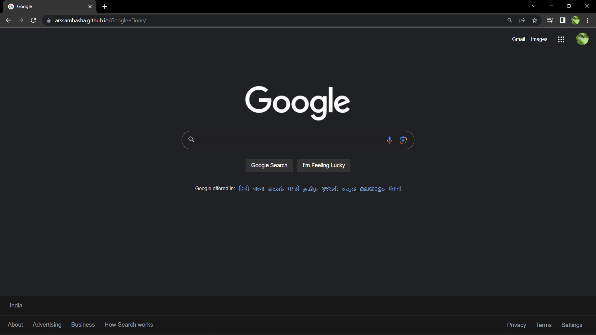
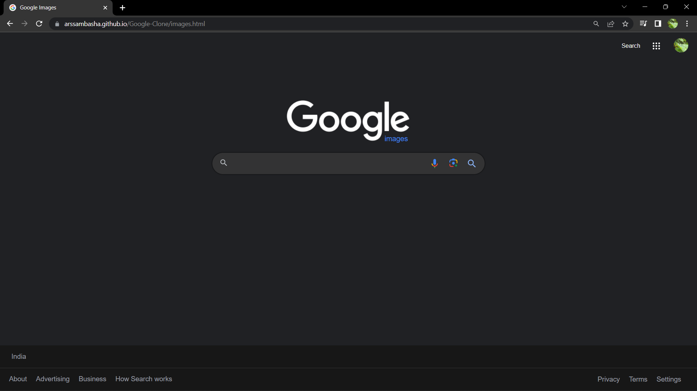

# Google-Clone

Google Search and Google Image Search built using HTML &amp; CSS

<h2><strong>To view the website : </strong></h2>
<h5>(click the google logo)</h5>  
<a href="https://arssambasha.github.io/Google-Clone/" target="blank"> &nbsp; &nbsp; &nbsp;  </a>

 
<h3>Here's the screenshots of the clone websites!👇 </h3>

